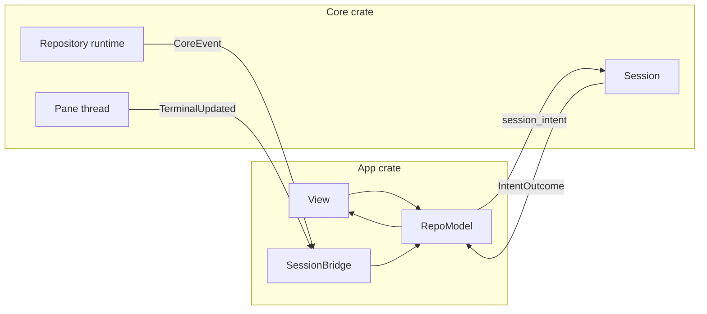

# App architecture

Status: Approved design
Date: 2026-09-03

## Purpose

How DeathPush is built on GPUI: the crates, the boundary between core logic and the UI, the app's models, views, and custom elements, the flow of intents and events, persistence, packaging, CI, and tests. The surface specs indexed in [screens](screens.md) say what each screen does; this spec says how the program that renders them is put together. The decision behind it is [ADR 1](../adr/0001-gpui-over-tauri.md).

## Workspace

```text
Cargo.toml          workspace: shared dependencies, lints, profiles
crates/core/        deathpush-core, a library with no gpui dependency
crates/app/         deathpush, the gpui binary
assets/             codicon SVGs, file-type icons, theme JSON, app icons, metainfo, dp launchers
docs/adr/           decision records
docs/specs/         surface specs and this spec
justfile            dev, build, lint, fmt, check, test, package, release
website/            the marketing site, with its own Astro toolchain
```

The repository has no JavaScript toolchain outside `website/`. The app version has one source, the app crate's `Cargo.toml`, and `just release` bumps it.

## Core crate

`deathpush-core` owns everything that does not need a window: git reads through git2, git writes through the git CLI, the session registry and intent policy, the repository runtime with its status coordinator and file watcher, the file index for Quick Open, the PTY layer, terminal state, diff rows, settings and layout files, theme parsing, shell environment resolution, and the CLI launcher installer.

`Core` is one struct created in `main`. It owns a tokio runtime, the repository runtime registry, the session registry, the terminal registry, and the settings store. Sessions are keyed by a core-defined `SessionId`, one per window. The app maps window handles to session ids, so core never sees gpui.

Operations are async methods on `Core` returning core types directly. There is no serialization boundary and no camelCase DTO layer. Serde derives stay on the types that reach disk or the network: settings, layout, recent projects, and the updater manifest. The operation set matches the former command table: `session_intent`, `session_snapshot`, workspace scanning, nested repository and worktree discovery, tree listing, file read and write with content hashes, file operations, fuzzy file search, content search, git config, terminal spawn, write, resize, and kill, foreground process lookup, and CLI installation.

Core methods run on core's tokio runtime through `spawn`. The join handle is a plain future, and the app awaits it inside `cx.spawn`. The git CLI keeps `tokio::process`; the watcher keeps `notify`.

### Events

Every former emit becomes a `CoreEvent` on an async channel per session:

- `SessionStatus`, `PathsChanged`, `RefsInvalidated`, and `StashesInvalidated` from the repository runtime
- `GitOutput` lines from the CLI runner, feeding the Output tab
- `TerminalUpdated(PaneId)` and `TerminalExited(PaneId)` from pane threads

### Terminal module

A pane is a PTY from `portable-pty` plus a `libghostty-vt` terminal on a dedicated thread, because those types are not `Send`. Key and mouse events are encoded on that thread with the `libghostty-vt` encoders and written to the PTY. Each VT update publishes a snapshot of styled cells, cursor, selection, and viewport for the renderer. Foreground-process polling, the shell name, and the exit signal work as they do today. Scrollback size, cursor, and font settings come from the settings store.

### Diff rows module

`diff_view` turns the `scm_file_diff` payload plus the diff settings into rows for the inline and the side-by-side layouts: old and new line numbers, change kind, word-level change ranges per the Inline Changes setting, hunk separators per the Hunk Separators setting, and the alignment of both columns. The app element only paints rows. Because the module is pure, its tests run without a window.

## App crate

### Globals

An `Arc<Core>`, a `Settings` entity, a `ThemeModel` entity, the recent projects list, and the updater. Each window has a root view that renders the welcome screen or the repository shell.

### Models

Models are entities with no render. They are the former stores, one to one.

| Model | Owns |
|---|---|
| `RepoModel` | status groups, branches, tags, stashes, commit log, operation state, ahead and behind, current diff, blame line, selection |
| `LayoutModel` | sidebar width and side, terminal visible, height, and maximized, main view, sidebar view, collapsed groups |
| `ExplorerModel` | tree nodes, expanded set, filter, selection, clipboard mark, open buffer |
| `TerminalModel` | groups, panes, active pane, pane sidebar width, Output or Terminal tab |
| `HistoryModel` | commit list, selected commit, changed files, file diff |

### Views

One view per surface, named after the spec it implements: title bar, sidebar with `ChangesView` and `ExplorerView`, main panel with `DiffPanel`, `HistoryView`, `SettingsView`, and `FileViewer`, then `TerminalPanel`, `StatusBar`, `ErrorToast`, and an overlay layer for the branch picker, Quick Open, the theme picker, the clone dialog, workspace settings, licenses, and confirmations.

Widgets come from gpui-component: buttons, inputs, the commit textarea, tree, virtual list, dialog, context menu, tooltip, select and toggle, resizable panes, and the command palette for the three pickers. The file viewer is the gpui-base editor with tree-sitter highlighting and the content-hash save. gpui-component's theme is fed from the app theme, so its widgets follow the picked theme.

### Custom elements

`DiffElement` paints rows from `diff_view`. It shapes only visible rows, caches tree-sitter highlight spans per content hash, paints line backgrounds and word ranges, both gutters, diff indicators, hunk separators with stage, unstage, and discard hitboxes, and the side-by-side divider. Text selection and copy work across rows. Image diffs use `img()`.

`TerminalElement` paints a pane snapshot: cells with colors and styles, the cursor per settings, the selection overlay, and hovered hyperlinks. Focus and key events go to the pane thread. The mouse handles selection, right-click word select, Option-click, copy on select, and scrollback. Resize derives columns and rows from the measured cell size.

### Actions and keys

Every shortcut and menu item in the surface specs is a gpui action. Key contexts: `Workspace`, `Terminal`, `Editor`, `Picker`, `Dialog`. One binding table generates the macOS bindings and the Ctrl bindings, including the `Cmd+K Cmd+T` chord. Native menus bind the same actions through `set_menus` and are rebuilt when repository state changes an item's enabled state. The Linux dropdown is a view over the same table, per [native menus](native-menus.md).

### Theme

The theme catalog is the tm-themes set embedded as JSON. A `Theme` value maps the `colors` map to UI tokens and the `tokenColors` scopes to tree-sitter captures by scope prefix. The picker, the preferred dark and light themes, and OS scheme switching follow [theme picker](theme-picker.md).

### Icons

The codicons the app uses are embedded as SVG and tinted by text color through `svg()`. File-type icons for the Complete tree setting come from an MIT-licensed set.

### Zoom

Zoom sets the window rem size. App styles use rem units.

## Data flow



- A view handler calls `RepoModel::dispatch(intent)`. The model awaits `core.session_intent` in `cx.spawn`, applies the outcome, and notifies. Generation and revision guards, the two cursor pairs, and stale-outcome drops keep the semantics of the former session client.
- A `SessionBridge` task per window drains the core event channel on the foreground executor and forwards each event to its model.
- `TerminalUpdated` marks the pane dirty and notifies once per batch. The element reads the latest snapshot when it paints.
- Settings and theme changes propagate through `cx.observe`. Diff rows recompute on the settings that affect them.

## Errors

Any core error sets that window's toast, per [app shell](app-shell.md). A `NeedsConfirmation` outcome opens a dialog and redispatches the intent with the confirmation flag. A pane thread panic closes the pane and shows a toast. Stale outcomes drop silently.

## Persistence

Files live in the OS config directory resolved by `dirs`:

- `settings.json`: app settings, the current theme, and the preferred dark and light themes
- `projects/<root-hash>.json`: per-project layout, collapsed groups, and recent files
- `recent-projects.json`
- `windows.json`: window bounds

Writes go to a temp file and rename, debounced 500 ms. Git identity stays in Git config. Nothing migrates from the former WebKit localStorage.

## Packaging and update

cargo-packager is configured in the app crate's `Cargo.toml`. Formats: dmg per architecture, deb, AppImage, and nsis. rpm is not built. The `dp` launchers ship as packager resources. The `deathpush://` scheme is registered on macOS by cargo-packager; the Windows registry entry and the Linux desktop entry are verified during the shell spike. Signing and notarization use the existing secrets.

cargo-packager-updater verifies the existing minisign key. CI writes `latest.json` in the updater's manifest shape at the same GitHub releases URL. The app checks on launch and from the menu, as today.

## CI

`ci.yml` runs fmt, clippy with warnings denied, and tests on macOS, Ubuntu, and Windows, with a Zig 0.16 setup step and the X11, Wayland, and fontconfig development packages on Ubuntu. Tests run headless through gpui's `test-support`. `publish.yml` builds per OS and architecture on a tag, runs cargo-packager, signs, notarizes, generates the manifest, and uploads. The website workflow is unchanged.

## Tests

- Core keeps every existing cargo test, including the storm and shell-env performance tests. New tests cover pane snapshots by feeding bytes to the VT and asserting cells, `diff_view` rows for both layouts and each diff setting, settings round-trips, and parsing of every bundled theme.
- The app uses `#[gpui::test]` for models applying outcomes and events, layout persistence, the keymap table per OS, menu enabled states, and `DiffElement` hit-testing.
- Before a release, the surface specs are walked by hand on macOS, Linux, and Windows.

## Contract changes

This design changes two surface contracts, and those specs are updated when the cutover lands:

- [SCM Changes](scm-changes.md): the working-tree diff is read-only. Editing happens in the Explorer file viewer. The merge view offers per-conflict accept choices instead of free-form editing.
- Distribution: rpm packages are not built.

## Cutover

Order matters because each step compiles on the previous one:

1. Throwaway spikes: gpui-kit builds on all three OSes with zoom checked, `libghostty-vt` builds with Zig on all three, and `DiffElement` paints a 100k-line diff.
2. Branch `release/0.4` from the v0.4.0 tag.
3. Workspace commit: the Rust tree moves to `crates/core`, emits become events, the frontend and Tauri are deleted, and CI is green on core tests.
4. Shell: window, theme, settings store, welcome screen, menus, multi-window, deep links, CLI installer.
5. Changes: sidebar, commit, groups, stash, merge banner, overflow, context menus, `DiffElement`, hunk actions.
6. Explorer, file viewer, Quick Open.
7. History, branch picker, theme picker, overlays.
8. Terminal: core panes, `TerminalElement`, groups and splits, Output tab.
9. Settings page.
10. Packaging, updater, publish workflow, AGENTS.md and README rewrite, the contract changes above, release.
