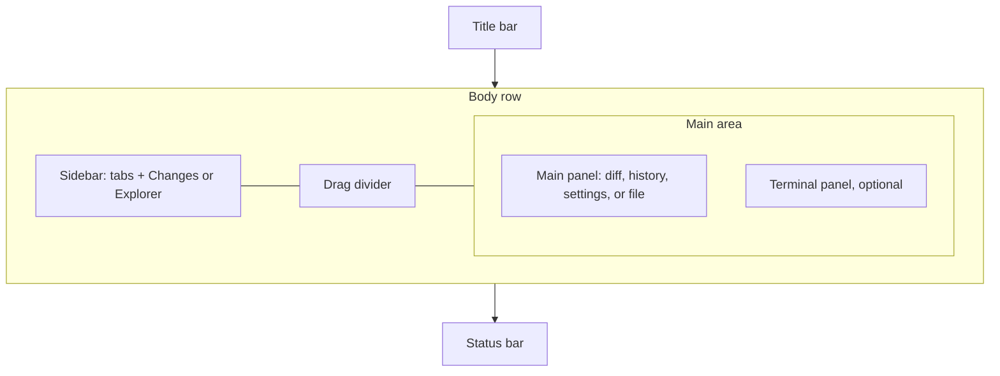

# App shell

Status: Current product
Date: 2026-09-02

## Purpose

The chrome around an open repository: title, a sidebar with Changes and Explorer, a main panel, an optional terminal panel, and a status bar. When no repository is open the [welcome screen](welcome-screen.md) replaces all of it.

## Layout

Column, top to bottom: title bar, body row, status bar.

Body row: sidebar, drag divider, main area. The main area is the main panel above the optional terminal panel. When Sidebar Position is Right, the row mirrors (main area, divider, sidebar).

Reference sizes: sidebar 300 wide (drag range 200 to 600), terminal 250 tall (drag range 100 to 600), status bar 22 tall. The terminal starts visible.

Terminal maximized: the terminal fills the whole main area and the divider between the main panel and the terminal disappears. Opening History or Settings docks the terminal back to its normal height.

Titles: the in-window title reads `{repoName} - {branch}`. The OS window title reads `{repoName} ({branch}) - DeathPush`, or `{repoName} - DeathPush` when HEAD is detached.

## Regions

**Title bar.** macOS: a thin draggable strip beside the native traffic lights with the centered title. Linux: a custom bar with window buttons (minimize, maximize, close) and a menu button that opens the flattened app menu. See [native menus](native-menus.md). Windows: the native title bar.

**Sidebar tabs.** Two equal-width tabs, `Changes` and `Explorer`, rendered uppercase in small bold text. The active tab is at full opacity with a 2px accent underline; inactive tabs are at half opacity. The body below is [SCM Changes](scm-changes.md) or [Explorer](explorer.md). Both keep their state when hidden.

**Sidebar divider.** Drag to resize the sidebar. The drag direction flips when the sidebar is on the right.

**Main panel.** One of: the SCM diff, [History](history.md), [Settings](settings.md), or the Explorer [file viewer](explorer.md). There is no tab strip. Switching happens by keyboard, menus, the status bar, or the sidebar tabs.

**Terminal panel.** [Terminal](terminal.md). A horizontal drag divider above it sets its height. Hidden when the terminal is off.

**Status bar.** Left to right: branch item (source-control icon, then the branch name or `No branch`; tooltip `Switch branch`), an optional sync badge, an optional blame line, a flexible spacer, an optional zoom item, and the last-commit item (commit icon, the message truncated with an ellipsis, relative time; tooltip `View history`).

**Error toast.** Bottom-right, error colors, above every overlay. Shows the latest error message. Click to dismiss.

## Controls

| Control | Copy | Action | Shortcut |
|---|---|---|---|
| Sidebar tab Changes | `Changes` | Show the SCM sidebar. Unless Settings is showing, the main panel switches to the SCM diff | Cmd/Ctrl+1 |
| Sidebar tab Explorer | `Explorer` | Show the Explorer sidebar. Unless Settings is showing, the main panel switches to the file viewer | Cmd/Ctrl+2 |
| Status branch | branch name or `No branch` | Open the [branch picker](branch-picker.md) | none |
| Status sync badge | `{behind}↓ {ahead}↑` | Display only. Hidden when both are 0 | none |
| Status blame | `{author}, {relative time} - {summary}` | Display only | none |
| Status zoom | `{percent}%` | Reset zoom to 100% | Cmd/Ctrl+0 |
| Status last commit | message and relative time | Open History | Cmd/Ctrl+Shift+2 |
| Sidebar divider | none | Resize the sidebar | none |
| Terminal divider | none | Resize the terminal | none |

## Copy

- `Changes`, `Explorer`
- `No branch`
- `Switch branch` (tooltip)
- `Reset Zoom` (tooltip)
- `View history` (tooltip)

## Visual

The title text is small, centered, and muted. The sidebar and status bar use the theme sidebar and status-bar backgrounds. Status bar text is 12px. Primary buttons everywhere use the theme primary button color. The app hardcodes no colors of its own outside the boot splash.

## States

**No repository.** The welcome screen replaces the shell.

**Default.** Sidebar on Changes, main panel on the SCM diff (empty or a file diff), terminal visible at its default height unless the per-project layout says otherwise.

**Settings or History open.** The main panel swaps. A maximized terminal docks. The sidebar stays.

**File view.** Selecting the Explorer tab switches the main panel to the file viewer.

**Zoomed.** The status bar shows the percent, computed as round(1.2 ^ level × 100). Level ranges from -5 to 9. Hidden at level 0.

**Blame.** When Git Blame is on and the file-viewer cursor is on a committed line, the status bar shows `{author}, {relative time} - {summary}`. Uncommitted lines show nothing.

**Always Open Terminal on Start.** When on, the terminal is forced visible whenever a project loads.

**Transient views.** Only Changes and History are restored when a project reloads. Settings and the file viewer reset to Changes.

## Interactions

**Resize.** Drag the sidebar or terminal divider. The new size persists per project.

**Sidebar tab.** Click a tab. If the main panel is not on Settings, it follows: Explorer shows the file viewer, Changes shows the SCM diff.

**Open History.** View menu, the status-bar last commit, or Cmd/Ctrl+Shift+2.

**Error.** Any failed operation sets the toast message. Click clears it.

**Close window.** If any terminal has a foreground process, the app asks for confirmation before closing. See [terminal](terminal.md).

## Keyboard

Repository window:

- Cmd/Ctrl+1: Changes
- Cmd/Ctrl+2: Explorer
- Cmd/Ctrl+3: show and focus the terminal
- Cmd/Ctrl+J: toggle the terminal
- Cmd/Ctrl+,: toggle between Settings and Changes
- Cmd/Ctrl+P: [Quick Open](quick-open.md)
- Cmd/Ctrl+K then Cmd/Ctrl+T: [theme picker](theme-picker.md). The chord expires after 1.5 s
- Cmd/Ctrl+= / Cmd/Ctrl+- / Cmd/Ctrl+0: zoom in, out, reset
- Cmd/Ctrl+Shift+P: toggle the diff layout (side by side or inline)
- Cmd/Ctrl+Shift+G: reload the session state from scratch
- Cmd/Ctrl+S: swallowed (files autosave; there is no save command)
- Escape: clear the SCM diff selection and the Explorer file selection, unless a find bar is open or focus is in a text field
- Alt+Cmd/Ctrl+1 to 9: activate terminal group n

Explorer-only shortcuts (focus inside the Explorer tree): F2, Delete or Cmd/Ctrl+Backspace, Cmd/Ctrl+C, Cmd/Ctrl+X, Cmd/Ctrl+V. See [explorer](explorer.md).

## Persistence

Per project: sidebar width, sidebar view, main view (Changes or History only), terminal visible, terminal height, terminal maximized, terminal panel tab, collapsed SCM groups, history list width.

App-wide settings: sidebar position, zoom level, Always Open Terminal on Start. See [settings](settings.md).
