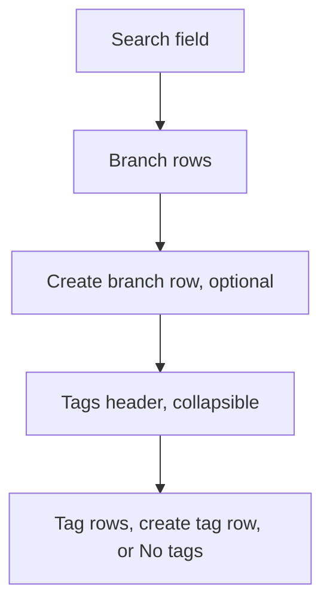

# Branch picker

Status: Current product
Date: 2026-09-02

## Purpose

A command-palette overlay for switching branches, creating a branch or tag from the search text, and running checkout, rename, merge, rebase, and delete from a row context menu. Opened from the status-bar branch item.

Related surfaces that are separate: the SCM overflow Merge Branch... and Rebase Branch... list ([scm-changes](scm-changes.md)), the SCM Nested Repositories rows that show a branch name, and the [clone dialog](clone-dialog.md), which has no branch control.

## Layout

Full-window transparent backdrop over the [app shell](app-shell.md). The panel is 400 wide, up to 300 tall, horizontally centered, 60 from the top. Inside: a search field, then a scrollable list: branches, an optional create-branch row, then a collapsible Tags section.

## Regions

**Search.** Placeholder `Switch to branch...`. Focused on open. Filters branches and tags as the user types.

**Branch rows.** One per branch: the current branch first, then local branches, then remote branches, each group by name. A row in rename mode becomes an inline text field.

**Create branch row.** Shown when the trimmed search is non-empty and no listed branch name equals it exactly (case-sensitive).

**Tags section.** Header `Tags ({count})` with a chevron, collapsed by default. Expanded: tag rows, an optional create-tag row, and `No tags` when there are none and the search is empty.

**Context menu.** Right-click a branch row.

**Confirmations.** System dialogs for every delete.

## Controls

| Control | Copy | Action | Shortcut |
|---|---|---|---|
| Status-bar branch item | branch name or `No branch`, plus optional `{n}↓` `{n}↑` | Open the picker | none |
| Search | placeholder `Switch to branch...` | Case-insensitive substring filter over branch and tag names | Escape closes; Enter checks out the first listed branch |
| Branch row | name, optional `{n}↑` `{n}↓` | Check out and close | click, or Enter on the first match |
| Context: Checkout | `Checkout` | Same as the row click | none |
| Context: Copy Branch Name | `Copy Branch Name` | Copy the full name (remotes keep the `origin/` prefix) | none |
| Context: Merge into Current Branch | `Merge into Current Branch` | Merge that branch into the current one, then close. Local, non-current branches only | none |
| Context: Rebase onto {name} | `Rebase onto {name}` | Rebase the current branch onto it, then close. Local, non-current only | none |
| Context: Rename Branch... | `Rename Branch...` | Inline rename. Local branches only | none |
| Context: Delete Branch | `Delete Branch` | Delete the local branch after confirmation; refuses unmerged branches. Local, non-current only | none |
| Context: Delete Remote Branch | `Delete Remote Branch` | Confirm, then delete the branch on the remote. Remote rows only | none |
| Rename field | current name | Enter or blur saves; Escape cancels | Enter, Escape |
| Create branch row | `Create branch: {search}` | Create from the current commit, check it out, close | click only |
| Tags header | `Tags ({count})` | Expand or collapse | click |
| Tag row | name, annotation message in muted text | No action; hover reveals the tag actions | none |
| Push Tag | tooltip `Push Tag` | Push the tag to the remote | click |
| Delete Remote Tag | tooltip `Delete Remote Tag` | Confirm, then delete on the remote | click |
| Delete Tag | tooltip `Delete Tag` | Confirm, then delete locally | click |
| Create tag row | `Create tag: {search}` | Create a lightweight tag at the current commit; clear the search; stay open | click only |
| Backdrop | none | Close | click outside, Escape |

Not offered: force-delete of a branch, arrow-key navigation, checking out a tag.

## Copy

- Status bar tooltip `Switch branch`; empty state `No branch`
- `Switch to branch...`
- `Create branch: {search}`
- `Tags ({count})`
- `No tags`
- `Create tag: {search}`
- Context: `Checkout`, `Copy Branch Name`, `Merge into Current Branch`, `Rebase onto {name}`, `Rename Branch...`, `Delete Branch`, `Delete Remote Branch`
- Tag tooltips: `Push Tag`, `Delete Remote Tag`, `Delete Tag`
- Remote branch confirmation: title `Delete Remote Branch`, message `Are you sure you want to delete remote branch "{name}"?`, a blank line, `This cannot be undone.`, buttons `Delete` and `Cancel`
- Remote tag confirmation: title `Delete Remote Tag`, message `Are you sure you want to delete remote tag "{name}"?`, a blank line, `This cannot be undone.`, buttons `Delete` and `Cancel`
- Local delete confirmations: title `Confirm`, message `Delete branch "{name}"?` or `Delete tag "{name}"?`, buttons `Continue` and `Cancel`
- Ahead badge `{n}↑`, behind badge `{n}↓`. The status bar shows behind first, then ahead, and hides both when they are 0

The current branch has no `HEAD` text badge; it is marked with a check icon.

## Visual

Status bar item: source-control icon, branch name, optional badges; 12px on the status-bar colors with a hover background.

Panel on the sidebar background with a subtle border, rounded corners, and a soft shadow. Search 32 tall on the input background with a bottom border. Rows 26 tall, 13px, hover background, names with an ellipsis. Icons 14px: check for the current branch, branch for local, cloud for remote, pencil for the rename row, plus for the create rows, chevron for the Tags header, bookmark for annotated tags, tag for lightweight tags, cloud-upload for Push Tag, cloud for Delete Remote Tag, trash for Delete Tag. Badges 11px at 70% opacity. Create rows use the "added" color. Tags header 12px semibold uppercase with a top border. Tag messages 11px muted, at most 120 wide, hidden on hover so the actions can show. The rename field sits on the input background with the focus border.

Context menu: at least 180 wide, sidebar background, rounded, shadow, blur behind (translucent on macOS and Windows). Items 26 tall with a 14px icon; hover uses the selection colors.

## States

**Closed.** The status bar shows the current branch.

**Open.** Search empty and focused, the full list, Tags collapsed, no create row.

**Filtering.** Non-matching branches and tags drop out; the tags count follows the filter.

**Create branch available.** Trimmed search non-empty with no exact match.

**Create tag available.** Tags expanded, trimmed search non-empty, no exact tag match.

**No tags.** Tags expanded, empty search, no tags: `No tags`.

**Current branch.** Check icon. Merge, rebase, and delete are omitted from its menu; Checkout still runs.

**Remote branch.** Cloud icon, no ahead or behind. Merge, rebase, rename, and local delete omitted; Delete Remote Branch present.

**Renaming.** The row becomes a focused, pre-selected text field. Empty or unchanged names cancel.

**Deleting.** Confirmation dialogs as listed. Cancel leaves the picker open.

**Error.** Failed actions show the app toast. Checkout, create, merge, and rebase close the picker even when they fail.

**Detached HEAD.** The status bar shows `No branch`; the picker still lists branches.

## Interactions

**Open.** Click the status-bar branch item. No keyboard shortcut and no menu item opens it.

**Close.** Escape, a backdrop click, or a successful checkout, create branch, merge, or rebase. Escape during a rename only cancels the rename.

**Checkout.** Click a branch, its Checkout item, or Enter on the first match.

**Create branch.** Click the create row. Enter never creates.

**Create tag.** Click the create row with Tags expanded. The search clears; the picker stays open.

**Rename.** Enter or blur saves; Escape restores.

**Merge and rebase.** Context menu only, local non-current branches. Conflicts surface as the SCM banner.

**Delete remote branch.** The remote is always the default remote `origin`.

## Keyboard

Search focused: Escape closes; Enter checks out the first listed branch when the list is not empty; typing filters.

Rename focused: Enter saves; Escape cancels the rename; blur saves.

No arrow keys.

## Git behavior

| Action | Effect |
|---|---|
| Checkout | Switch to the branch |
| Create branch | New branch from the current commit, checked out |
| Rename | Rename the local branch |
| Delete local | Delete; refuse if unmerged |
| Delete remote | Delete the branch on `origin` |
| Merge | Merge the branch into the current one |
| Rebase | Rebase the current branch onto it |
| Create tag | Lightweight tag at the current commit |
| Delete tag | Delete the local tag |
| Push tag | Push the tag to `origin` |
| Delete remote tag | Delete the tag on `origin` |

Branch and tag lists refresh after every action. Nothing about this overlay persists.
