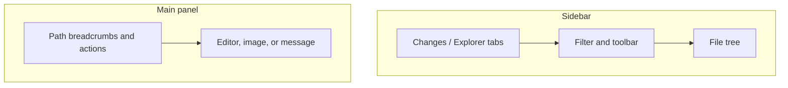

# Explorer

Status: Current product
Date: 2026-09-02

## Purpose

The file tree in the sidebar and the file viewer in the main panel for an open repository. The tree lists tracked, untracked, and ignored entries. Selecting a file opens it in the main panel as an editable text file, an image preview, or a message for binary and very large files.

## Layout

Sidebar, top to bottom: the shared `Changes` / `Explorer` tabs, a header with a filter field and a toolbar, then the tree. Main panel: a header with the path and actions, then the file body.

Nested repositories are not listed here; they appear on [SCM Changes](scm-changes.md).

## Regions

**Header (repository open).** 35 tall. Left: a filter field with a search icon and the placeholder `Filter files...`; a clear button appears when the filter is non-empty. Right: icon buttons New File, New Folder, Refresh Explorer.

**Header (no repository).** Title `Explorer` (rendered uppercase). The body is the empty state.

**Tree.** Folders with chevrons, files with type icons per the Tree Icons setting, row density per the Tree Density setting. Ignored entries are dimmed. Changed files carry the same status letter and color as in SCM. The selected file is highlighted. Expanding a folder loads its children on demand.

**Item context menu.** Right-click on a file or folder row.

**Blank-area context menu.** Right-click on the tree background: New File, New Folder, and Paste when the clipboard holds an entry.

**File viewer header.** 35 tall. Breadcrumb path with ` / ` between segments and the full path as tooltip. A ` *` suffix while a save is pending. Right: Reveal in Finder (files on disk that are not binary or large) and Open in Editor.

**File viewer body.** A code editor with syntax highlighting for text; a centered image for images; a centered message plus `Open in External Editor` for binary files and files over 5 MB; an empty state when nothing is selected.

**Status bar.** The cursor line feeds the blame line in the [app shell](app-shell.md). Blame is a status-bar line, not a gutter.

## Controls

| Control | Copy | Action | Shortcut |
|---|---|---|---|
| Tab | `Explorer` | Show Explorer and the file viewer | Cmd/Ctrl+2 |
| Tab | `Changes` | Show SCM and the diff panel | Cmd/Ctrl+1 |
| Filter | placeholder `Filter files...` | Filter the tree by name as you type | none |
| Filter clear | close icon | Clear the filter | none |
| New File | tooltip `New File` | Create `New File` at the root and start renaming it | none |
| New Folder | tooltip `New Folder` | Create `New Folder` at the root and start renaming it | none |
| Refresh | tooltip `Refresh Explorer` | Reload the tree | none |
| Open Repository (empty state) | `Open Repository` | System folder picker | none |
| Row click | name | Select; a file also opens in the viewer | none |
| Row activate (file already open) | name | Dock the terminal and keep the file view | none |
| Inline rename | current name | Rename, or confirm a new file or folder | F2 starts it |
| Context: New File... | `New File...` | Create in that folder | none |
| Context: New Folder... | `New Folder...` | Create in that folder | none |
| Context: Open in Editor | `Open in Editor` | Open in the system editor (files only) | none |
| Context: Rename | `Rename` | Start inline rename | F2 |
| Context: Duplicate | `Duplicate` | Copy next to the original with a ` copy` suffix | none |
| Context: Cut | `Cut` | Mark for move | Cmd/Ctrl+X |
| Context: Copy | `Copy` | Mark for copy | Cmd/Ctrl+C |
| Context: Paste | `Paste` | Copy or move the marked entry into this folder, or into the parent of this file | Cmd/Ctrl+V |
| Context: Reveal in Finder | `Reveal in Finder` | Show in the system file manager | none |
| Context: Copy Path | `Copy Path` | Copy the absolute path | none |
| Context: Copy Relative Path | `Copy Relative Path` | Copy the repository-relative path | none |
| Context: Move to Trash | `Move to Trash` | Move to the system trash after confirmation | Delete, or Cmd/Ctrl+Backspace |
| Context: Add to .gitignore | `Add to .gitignore` | Append the path to `.gitignore` | none |
| Blank-area: New File..., New Folder..., Paste | same | The same actions at the root | none |
| Viewer: Reveal in Finder | tooltip `Reveal in Finder` | Show in the file manager | none |
| Viewer: Open in Editor | tooltip `Open in Editor` | Open in the system editor | none |
| Viewer: Open in External Editor | `Open in External Editor` | Open in the system editor (binary or large files) | none |

Paste is disabled when nothing is marked. The blank-area menu omits Paste entirely in that case.

## Copy

Header: `Filter files...`, `New File`, `New Folder`, `Refresh Explorer`, `Explorer`.

Empty sidebar: `No repository open`, `Open Repository`.

Empty viewer: `Select a file to view its contents`.

Large file: `File is too large to display (over 5 MB)`, `Open in External Editor`.

Binary file: `Binary file cannot be displayed`, `Open in External Editor`.

Viewer tooltips: `Reveal in Finder`, `Open in Editor`. Pending-save marker: ` *`. Breadcrumb separator: ` / `.

New entry names: `New File`, `New Folder`, then `New File 2`, `New Folder 2`, and up.

Duplicate names: `{stem} copy{ext}`, then `{stem} copy 2{ext}`, and up.

Item context menu, in order: `New File...`, `New Folder...`, `Open in Editor`, `Rename`, `Duplicate`, `Cut`, `Copy`, `Paste`, `Reveal in Finder`, `Copy Path`, `Copy Relative Path`, `Move to Trash`, `Add to .gitignore`.

Blank-area menu: `New File...`, `New Folder...`, `Paste`.

Delete confirmation (system dialog): title `Confirm`, message `Move "{path}" to the trash?`, buttons `Continue` and `Cancel`.

File conflict (system dialogs): title `File Conflict`. First, warning style: `A file with this name already exists. Do you want to replace it?` If declined, info style: `Keep both files? A copy will be created with a new name.`

Rename or move error (toast): `"{name}" already exists` or `"{name}" already exists in destination`.

## Visual

Tabs: 35 tall, 11px bold uppercase with slight tracking; inactive at half opacity, active with a 2px accent underline.

Header: 35 tall with a bottom border. Filter field 22 tall on the input background with rounded corners and the focus border when focused; search icon at half opacity. Toolbar buttons are 22 square, transparent, with a hover background.

Tree: type icons and chevrons per settings; ignored entries dimmed; the selected row highlighted with no focus ring.

Context menus: at the pointer, at least 180 wide, on the sidebar background with a subtle border, rounded corners, and a blur behind them (translucent on macOS and Windows). Items 26 tall, 13px, with a 14px icon. Hover uses the selection colors. Disabled items at 40% opacity.

File viewer header: 35 tall with a bottom border; breadcrumbs 12px with an ellipsis. Body: the editor background; font, size, line height, and tab size from the Editor settings; line numbers per the Diff Viewer Line Numbers setting; wrap per Word Wrap. Empty state: the app mark at 80px and 7% opacity above the prompt at 40% opacity. Binary and large messages at 70% opacity with a 32px warning or binary icon at 40%. Images fit within the panel.

Empty sidebar: centered muted text and a primary `Open Repository` button with a folder icon.

## States

**No repository.** Title `Explorer`, `No repository open`, `Open Repository`. No tree, no filter.

**Loading.** The tree loads when the repository opens. Errors go to the toast. No spinner.

**Populated.** Tracked and untracked files, ignored entries dimmed. `.git`, `.svn`, `.hg`, `.DS_Store`, and `Thumbs.db` never appear.

**Filtered.** The tree is filtered by name; the clear button is visible.

**No file selected.** Empty viewer state.

**File selected, loading.** Breadcrumbs and actions show; the body is blank until the content arrives.

**Text file.** Editable. Saves 1 s after the last edit. ` *` shows while a save is pending. If the file changes on disk with no pending save, the viewer reloads it.

**Image.** Preview, with Reveal and Open in Editor.

**Binary.** Message and Open in External Editor only.

**Large (over 5 MB).** Message and Open in External Editor only.

**Creating or renaming.** An inline field in the tree. Cancelling a create removes the placeholder row.

**Clipboard.** Cut or Copy marks one entry in memory. Paste is disabled until then. A cut mark clears after a successful move.

**Conflict.** A move, copy, or paste onto an existing name runs the two-step File Conflict dialogs. Declining both cancels. Replace overwrites; Keep both creates a numbered copy.

**Delete.** Confirmation dialog. Continue moves the entry to the trash; if it was open in the viewer, the viewer clears.

**Drag and drop.** Dragging inside the tree moves entries. Dropping files from the OS onto the window imports them into the repository root.

## Interactions

**Select file.** Loads the content, opens the viewer, docks the terminal, switches the main panel to the file viewer, and records a recent file. Clicking the already open file only docks the terminal.

**Select folder or several entries.** Updates the selection without opening a file. Multi-select opens nothing.

**Expand folder.** Loads children on first expand. Ignored folders are stubs until expanded.

**Create.** Inserts `New File` or `New Folder` (numbered if taken) and starts renaming. Confirming writes an empty file or creates the folder.

**Rename.** F2 or the context item. Confirm on Enter or blur; Escape cancels. If the renamed file is open, the viewer path follows.

**Duplicate.** Creates the copy and refreshes.

**Cut, copy, paste.** Keyboard paste skips the conflict dialogs and reports errors as a toast. Context and drop paste run the dialogs.

**Delete.** Context item, Delete, or Cmd/Ctrl+Backspace, then the confirmation.

**Add to .gitignore.** Appends the path.

**Open in Editor, Reveal.** The system editor and the system file manager (Finder on macOS).

**Copy Path, Copy Relative Path.** To the clipboard.

**Escape.** Clears the open file (and the SCM diff) unless a find bar is open or focus is in the tree or a text field.

**Quick Open.** Can open a file at a line; the viewer scrolls to and focuses that line once.

**External changes.** File additions, removals, and renames refresh the tree, coalesced to at most once per second. Changes to the open file reload it when no save is pending.

## Keyboard

Active when the Explorer sidebar is showing, focus is inside it, and the target is not a text field.

| Shortcut | Action |
|---|---|
| F2 | Rename the selected entry |
| Delete | Move the selected entry to the trash (confirm) |
| Cmd/Ctrl+Backspace | Same as Delete |
| Cmd/Ctrl+C | Copy the selected entry |
| Cmd/Ctrl+X | Cut the selected entry |
| Cmd/Ctrl+V | Paste into the selected folder, or into the parent of the selected file |
| Escape | Clear the open file (global) |
| Cmd/Ctrl+2 / Cmd/Ctrl+1 | Explorer / Changes (global) |
| Cmd/Ctrl+S | Swallowed; autosave handles writes |
| Cmd/Ctrl+P | [Quick Open](quick-open.md) |

Arrow keys and Enter inside the tree are standard tree navigation.

## Persistence

App-wide: tree density, tree icons, editor font and wrap, line numbers. Session only: expanded folders, filter, clipboard mark. Recent files: see [Quick Open](quick-open.md).
