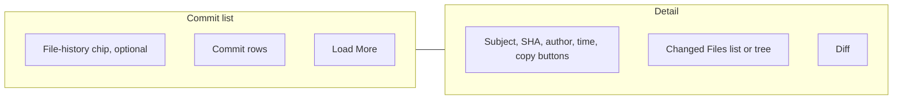

# History

Status: Current product
Date: 2026-09-02

## Purpose

The commit log and per-commit diff, shown in the main panel of a repository window. The SCM sidebar stays visible.

## Layout

Horizontal split: the commit list on the left (300 wide by default, drag 200 to 600), a divider, then the detail column: header, changed files, then the diff.

## Regions

**File-history chip.** When the list is filtered to one file: history icon, the file's base name, and a close button (tooltip `Show full history`).

**Commit list.** One row per commit: author avatar, subject (first line), relative time, short SHA, a merge badge for merge commits, author name. The selected row is highlighted. `Load More` at the bottom.

**Detail, empty.** A history icon and `Select a commit to view details`.

**Detail header.** Subject, short SHA in the accent color, a middot, author, a middot, relative time, then copy buttons (full SHA, message, email). The commit body follows when present. Merge commits list their parents.

**Changed files.** `Changed Files ({n})` (rendered uppercase) with a list/tree toggle. Each row: file icon, path, status letter badge. Renames show `{oldPath} -> {path}`.

**Diff.** A path header, then a side-by-side or inline text diff, or an image comparison for images. The layout follows the Diff Layout setting.

## Controls

| Control | Copy | Action | Shortcut |
|---|---|---|---|
| Commit row | subject, time, SHA, author | Select the commit and load its detail | none |
| Load More | `Load More` | Append the next page of commits | none |
| Copy SHA | tooltip `Copy full SHA` | Copy the full commit id | none |
| Copy message | tooltip `Copy commit message` | Copy the full message | none |
| Copy email | tooltip `Copy email` | Copy the author email | none |
| List/tree toggle | tooltip `Show as tree` / `Show as list` | Switch the changed-files presentation | none |
| File row | path and badge | Show that file's diff for this commit | none |
| Chip close | tooltip `Show full history` | Clear the file filter | none |
| Status bar last commit | none | Open History | none |
| View menu History | `History` | Open History | Cmd/Ctrl+Shift+2 |
| Context: Copy Commit ID | `Copy Commit ID ({shortId})` | Copy | none |
| Context: Copy Commit Message | `Copy Commit Message` | Copy | none |
| Context: Cherry-pick | `Cherry-pick Commit` | Cherry-pick onto the current branch | none |
| Context: Reset | `Reset (Soft)` / `Reset (Mixed)` / `Reset (Hard)` | Reset the current branch to this commit, after confirmation | none |

## Copy

- `No commits found`
- `Select a commit to view details`
- `Changed Files ({n})`
- `Show as tree`, `Show as list`
- `Show full history`
- `Load More`
- `Merge: {parent}, {parent}`
- `Copy full SHA`, `Copy commit message`, `Copy email`
- Context items listed above
- Rename: `{oldPath} -> {path}`

## Visual

Rows show circular avatars: the GitHub avatar for GitHub no-reply emails, otherwise the Gravatar for the email; when neither loads, the author's initials on a color derived from the name. The selected row uses the list selection color. Status badges are single letters (`M`, `A`, `D`, `R`, and so on).

## States

**Empty log.** `No commits found`.

**No selection.** Empty detail.

**Selected.** Header and file list. The diff appears after a file is clicked.

**Merge commit.** Merge badge on the row; `Merge: ` and the parents in the detail.

**Image file.** Image comparison instead of a text diff.

**File history.** The list shows only commits that touch one path; the chip shows at the top.

**Load more.** Appends the next page.

## Interactions

**Open.** View menu, Linux menu, the status-bar last commit, or a `Show File History` action from Explorer or SCM (which also sets the file filter).

**Select.** Click a row to load its detail.

**Cherry-pick.** Applies the commit to the current branch. Errors go to the toast.

**Reset.** Confirmation first (system dialog, `Continue` / `Cancel`). Hard reset discards working changes and is irreversible.

**Context menu.** Right-click a commit row.

## Keyboard

No list navigation keys. Cmd/Ctrl+Shift+2 opens the view. Cmd/Ctrl+Shift+P toggles the diff layout. Escape clears the SCM and Explorer selection, not the History selection.

## Persistence

Per project: the commit list width. App-wide: the diff layout.
