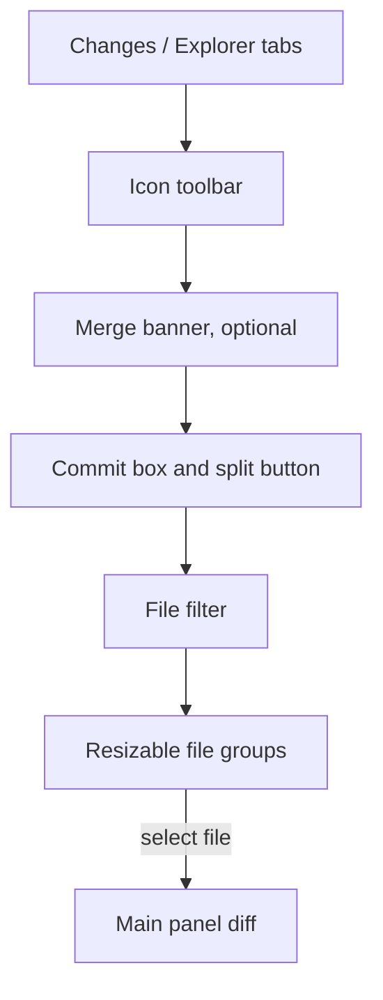

# SCM Changes

Status: Current product
Date: 2026-09-02

## Purpose

The working Git surface in the sidebar: write a commit message, stage and unstage files, stash, continue or abort an in-progress merge or rebase, and open a file's diff in the main panel. Shared chrome is in the [app shell](app-shell.md). This spec covers the Changes tab body, its overflow menu, and the main-panel diff that a file selection opens.

## Layout

Sidebar, top to bottom:

1. Tabs `Changes` / `Explorer`.
2. Icon toolbar (only with a repository open).
3. Merge or rebase banner (only during an operation).
4. Commit message box and the split Commit button.
5. File filter (only when at least one file is changed).
6. Either the `No changes` watermark, or resizable groups: Merge Changes, Staged Changes, Changes, Stashes, Nested Repositories.

Groups share the remaining height. A 4px divider between two expanded groups resizes them. Clicking a group header collapses it; collapsed headers stack at the bottom. Nested Repositories starts collapsed. Collapse state persists per project.

Selecting a file switches the main panel to the diff, docks the terminal, and loads the diff.

## Regions

**Tabs.** Full width. The active tab is at full opacity with a 2px accent underline; inactive at half opacity.

**Toolbar.** Right-aligned icon buttons in a 35-tall header. Hidden without a repository.

**Merge banner.** A full-width warning strip while a merge, rebase, cherry-pick, or revert is in progress: warning icon, label, then `Continue`, `Skip` (rebase only), and `Abort` as the operation allows.

**Commit box.** A multiline text field and a full-width split button (main action plus a chevron for the dropdown).

**File filter.** A search field between the commit box and the groups.

**Empty body.** With a repository and no changes: the centered watermark and `No changes`; the toolbar and commit box stay. Without a repository: `No repository open` and `Open Repository`.

**Groups.** One resizable group per non-empty (after filtering) status group, then Stashes when any exist, then Nested Repositories when any exist.

**Main panel diff.** Empty: watermark and `Select a file to view changes`. With a selection: a path header, then a text diff, an image comparison, a merge-conflict editor, or a binary or large-file message.

## Controls

| Control | Copy | Action | Shortcut |
|---|---|---|---|
| Tab Changes | `Changes` | SCM sidebar and diff panel | Cmd/Ctrl+1 |
| Tab Explorer | `Explorer` | Explorer sidebar and file viewer | Cmd/Ctrl+2 |
| Toolbar plus | tooltip `Stage All Changes` | Stage everything | none |
| Toolbar refresh | tooltip `Refresh` | Rescan status | none |
| Toolbar sync or fetch | tooltip `Sync: {behind}↓ {ahead}↑` or `Fetch` | One button: pull then push when the branch tracks an upstream, otherwise fetch. Hidden when neither applies | none |
| Toolbar ellipsis | tooltip `More Actions...` | Open the overflow menu | none |
| Commit message | placeholder `commit message` | Edit the message | Cmd/Ctrl+Enter commits |
| Commit button | `Commit`, `Commit All`, `Amend`, or `Amend All` | Commit (confirm when amending) | Cmd/Ctrl+Enter |
| Commit chevron | tooltip `More commit options` | Open the commit dropdown | none |
| Dropdown Commit | `Commit` | Same as the button | none |
| Dropdown Commit (Amend) | `Commit (Amend)` | Switch the button to amend mode; does not commit yet | none |
| Dropdown Commit & Push | `Commit & Push` | Commit, then push | none |
| Dropdown Commit & Sync | `Commit & Sync` | Commit, then pull and push | none |
| File filter | placeholder `Filter files...` | Filter paths, applied 150 ms after typing stops | none |
| Filter clear | close icon | Clear | none |
| Banner Continue | `Continue` | Continue the operation | none |
| Banner Skip | `Skip` | Skip the current rebase commit | none |
| Banner Abort | `Abort` | Abort the operation | none |
| Group header | label and count | Collapse or expand | none |
| Staged header minus | tooltip `Unstage All` | Unstage every staged file | none |
| Changes header discard | tooltip `Discard All Changes` | Discard every change in the group, after confirmation | none |
| Changes header plus | tooltip `Stage All Changes` | Stage the group | none |
| File row | path | Open the diff | none |
| Stash apply | tooltip `Apply Stash` | Apply, keeping the stash | none |
| Stash pop | tooltip `Pop Stash` | Apply and drop | none |
| Stash drop | tooltip `Drop Stash` | Drop after confirmation | none |
| Nested repository row | name and branch | Open that repository in a new window | none |
| Empty Open Repository | `Open Repository` | System folder picker | none |
| Diff header history | tooltip `Show File History` | Open History filtered to this file | none |
| Diff header layout | tooltip `Switch to side by side` / `Switch to inline` | Toggle the Diff Layout setting | Cmd/Ctrl+Shift+P |
| Diff Open in External Editor | `Open in External Editor` | Open the file in the system editor | none |

## Copy

**Toolbar tooltips:** `Stage All Changes`, `Refresh`, `Fetch`, `Sync: {behind}↓ {ahead}↑`, `More Actions...`.

**Banner labels:** `Merge in progress`, `Rebase in progress`, `Cherry-pick in progress`, `Revert in progress`, fallback `Operation in progress`. Buttons `Continue`, `Skip`, `Abort`.

**Commit:** placeholder `commit message`. Field tooltip `⌘+Enter to commit on "{branch}"` on macOS, `Ctrl+Enter to commit on "{branch}"` elsewhere (`HEAD` when detached). Button labels `Commit`, `Commit All`, `Amend`, `Amend All`; tooltip `Commit staged changes` or `Amend staged changes`. Chevron tooltip `More commit options`. Dropdown `Commit`, `Commit (Amend)`, `Commit & Push`, `Commit & Sync`.

**Empty:** `No changes`. No repository: `No repository open`, `Open Repository`.

**Filter:** `Filter files...`.

**Group labels (rendered uppercase):** `Merge Changes`, `Staged Changes`, `Changes`, `Stashes`, `Nested Repositories`.

**Overflow menu, in order:**

- `Pull`
- `Pull (Rebase)`
- `Push`
- `Push (Force)`
- `Fetch`
- `Sync`
- `Merge Branch...`
- `Rebase Branch...`
- `Stage All Changes`
- `Unstage All Changes`
- `Discard All Changes`
- `Stash Changes`
- `Stash (Include Untracked)`
- `Stash Staged Only`
- `Stash Pop (Latest)`
- `Undo Last Commit`
- `Open Repository...`
- `Clone Repository...`

Branch list inside the overflow: header `Merge` or `Rebase onto`, placeholder `Select a branch...`, empty `No matching branches`.

**File context menu, in order:** `Open Changes`, `Open File`, `Show File History`, then `Unstage Changes` (staged rows) or `Stage Changes` (unstaged rows), then `Discard Changes`, then `Copy Path`, `Copy Relative Path`, `Reveal in Finder`, then `Move to Trash` (unstaged rows only).

**Stash tooltips:** `Apply Stash`, `Pop Stash`, `Drop Stash`.

**Main panel:** `Select a file to view changes`. Binary: `Binary file cannot be displayed`. Large: `File is too large to display (over 5 MB)`. Header suffix `(Staged)`, `(Working Tree)`, or `(Merge)`.

**Confirmations (system dialog):** title `Confirm`, warning style, buttons `Continue` and `Cancel`. Messages:

- Discard mixed: `Are you sure you want to discard {n} change(s) and DELETE {m} untracked file(s)?` then `Tracked changes are irreversible. Untracked files can be restored from the Trash.`
- Discard one untracked: `Are you sure you want to DELETE the following untracked file: '{name}'?` then `You can restore this file from the Trash.`
- Discard many untracked: `Are you sure you want to DELETE {n} untracked file(s)?` then `You can restore them from the Trash.`
- Discard one tracked: `Are you sure you want to discard changes in "{name}"?` then `This action is irreversible.`
- Discard many tracked: `Are you sure you want to discard all {n} change(s)?` then `This action is irreversible.`
- Undo commit: `Undo last commit? Changes will be moved back to staging.`
- Amend: `Amend the last commit with the current message and staged changes?`
- Force push: `Force push may overwrite remote changes.`
- Drop stash: `Drop this stash?`
- Move to trash: `Move "{path}" to the trash?`

## Visual

Tabs 35 tall, 11px bold uppercase with slight tracking. Toolbar buttons 22 square with a hover background; disabled at half opacity.

Merge banner on the theme warning background with the warning-colored icon; `Abort` in error colors; `Continue` and `Skip` as secondary buttons, in the order Continue, Skip, Abort.

Commit box on the input background with 8px padding; the field grows from 42 to 180 tall in a monospace font. Split button 26 tall with a check icon on the left and a 26-wide chevron separated by a hairline. Dropdown rows 26 tall, at least 220 wide, on the menu colors.

Empty watermark: the app mark at 48px and 12% opacity, the label at 18% opacity.

Group headers 22 tall, 11px bold uppercase, with the count in a badge and a chevron that rotates when collapsed.

File rows: type icon, path, and a status letter badge colored by status. Density and icons follow the tree settings.

Stash rows 22 tall with an archive icon and the message with an ellipsis; apply (check), pop (arrow up), and drop (trash) appear on hover.

Nested repository rows: repository icon, name, and the branch in muted text (at most 120 wide).

Overflow menu: anchored under the ellipsis, 200 wide (260 in branch-list mode), on the sidebar background with rounded corners and a shadow. Remote branches carry a cloud icon, local ones a branch icon.

Main diff: the path header, then the diff in side-by-side or inline layout per settings.

## States

**No repository.** Toolbar and commit box hidden; `No repository open` and `Open Repository`.

**No changes.** Toolbar, commit box, watermark. No filter, no groups.

**Populated.** Filter shown. Groups: Merge Changes (during conflicts), Staged Changes, Changes (unstaged and untracked together), Stashes when any, Nested Repositories when any (collapsed by default).

**Filtered.** Case-insensitive substring on the path. Groups with no match disappear.

**Cannot commit.** Button and chevron disabled when the message is empty, there is nothing to commit, or a commit is running. A spinner replaces the check while committing.

**Amend.** After `Commit (Amend)` the label becomes `Amend` or `Amend All`, and committing asks for confirmation.

**Commit All.** Nothing staged but working changes exist: the label reads `Commit All`, and committing stages everything first.

**Network busy.** Pull, Push, Fetch, and Sync are disabled while any of them runs; the toolbar sync or fetch button shows a spinner.

**Detached HEAD.** Pull, Push, Sync, Merge Branch..., and Rebase Branch... are disabled in the overflow.

**Operation in progress.** Banner shown. Continue and Abort as allowed; Skip only while rebasing.

**Confirmation.** Destructive actions ask first. Cancel changes nothing.

**Diff empty.** No selection: watermark and `Select a file to view changes`.

**Diff kinds.** Text: read-only. Editing happens in the Explorer file viewer. Image: side-by-side images. Binary or large: message plus `Open in External Editor`. Merge conflict: per-conflict accept choices.

**Error.** Failures show the app toast.

## Interactions

**Tabs.** Changes and Explorer both keep their state when hidden.

**Stage and unstage.** The toolbar plus stages everything. A group's plus stages that group; its minus unstages. Pending editor saves flush before staging. The file context menu stages or unstages the selected rows (multi-select when the clicked row is part of the selection).

**Select file.** Click or activate a row to open its diff. Activating the already selected row reloads the diff.

**Discard.** Group discard, overflow Discard All, and the context item all confirm first. Untracked files go to the trash; tracked changes are reverted.

**Commit dropdown.** Click outside or Escape closes. `Commit (Amend)` only arms amend mode. `Commit & Push` and `Commit & Sync` commit first, then push or sync.

**Overflow.** Anchored to the ellipsis and kept inside the window. Click outside or Escape closes. Merge Branch... and Rebase Branch... swap the menu for a branch list (every branch except the current one) with a search field; Enter picks the first match. Clone Repository... opens the [clone dialog](clone-dialog.md). Open Repository... opens the folder picker.

**Overflow actions:**

- Pull: pull with merge. Pull (Rebase): pull with rebase.
- Push. Push (Force): confirm, then force push.
- Fetch: fetch and prune deleted remote branches.
- Sync: pull, then push.
- Merge Branch... / Rebase Branch...: pick, then merge or rebase.
- Stage All Changes, Unstage All Changes, Discard All Changes (confirm).
- Stash Changes: tracked changes. Stash (Include Untracked): plus untracked files. Stash Staged Only: only the index. Stash Pop (Latest): pop the newest stash.
- Undo Last Commit: confirm, then move the last commit's changes back to the index.

Disabled: Pull, Push, Sync, Merge, Rebase when there is no branch; network items while one runs; Stage All, Unstage All, Discard All when there is nothing to act on; Stash Staged Only when nothing is staged; Stash Pop when there are no stashes; Undo when there is no commit.

**Stash rows.** Apply keeps the stash; Pop applies and removes; Drop confirms then removes.

**Nested repository.** Opens in a new window.

**File context menu.** `Open File` opens in the system editor. `Show File History` switches to History filtered to that path. `Reveal in Finder` shows the file in the file manager. `Move to Trash` confirms, then trashes.

**Diff header.** The history icon opens History for the path. The layout icon toggles side by side and inline.

**Hunks.** The working-tree diff can stage, unstage, or discard a single hunk. Discarding a hunk asks for confirmation. The Inline Hunk Actions setting shows or hides the per-hunk buttons.

**Escape.** Outside a text field: clears the diff selection and the Explorer selection. Open menus close first.

## Keyboard

| Chord | When | Action |
|---|---|---|
| Cmd/Ctrl+1 | Anywhere | Changes tab and diff panel |
| Cmd/Ctrl+2 | Anywhere | Explorer |
| Cmd/Ctrl+Enter | Commit field focused | Commit |
| Escape | Overflow open | Close (leave the branch list first) |
| Escape | Commit dropdown open | Close |
| Escape | No menu, not in a field | Clear the diff selection |
| Cmd/Ctrl+Shift+P | Anywhere | Toggle the diff layout |
| Enter | Overflow branch list | Merge or rebase onto the first match |

Overflow items show no shortcuts.

## Persistence

Per project: collapsed groups, sidebar view, main view. App-wide: tree density, tree icons, diff layout. The commit message and the filter live only for the session.

## Git behavior

- Status groups: staged (index), unstaged plus untracked (`Changes`), and merge conflicts (`Merge Changes`). Untracked files are never a separate group.
- Status letters: modified, type-changed, and both-modified show `M`; added, intent-to-add, and add conflicts show `A`; deleted variants show `D`; renamed and copied show `R`; untracked shows `U`; ignored dims the row.
- Operations in progress: merge, rebase, cherry-pick, revert.
- Fetch always prunes.
- Every Git command the app runs is logged in the terminal Output tab.
